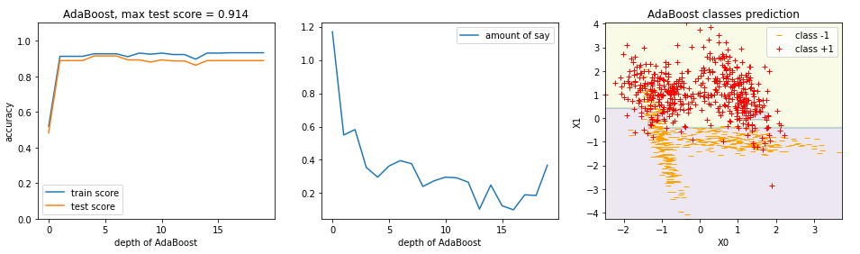

## AdaBoost

AdaBoost algorithm based on stumps. Each followed model is being trained on resampled data.

You can follow my video manual on YouTube (на Русском) and create algorithm for classification

or for regression

The idea was taken from the article "AdaBoost.RT: a boosting algorithm for regression problems", Solomatine, Shrestha.
Several algorithms are explaned there, for classification and regressin problem. Also you can find Druker method.

This implementation trains Dicision Tree, then compares results with AdaBoost method.
At the end yot can explore the error, stumps weights and prediction.

